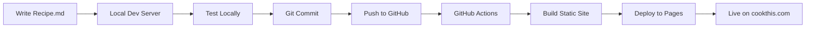

# CookThis.com - Tech Stack & Development Plan

## 🍳 Project Overview

**CookThis** is a modern, minimalist recipe website built with Astro and deployed on GitHub Pages. The philosophy is simple: "No fluff. Just cook this." - providing easy, delicious recipes without ads, life stories, or endless scrolling.

**Live Site:** https://cookthis.com

---

## 🛠 Current Tech Stack

### Core Technologies
| Technology | Version | Purpose |
|------------|---------|---------|
| **Astro** | 5.17.1 | Static site generator with content collections |
| **TypeScript** | Latest | Type-safe development |
| **Tailwind CSS** | 4.2.0 | Utility-first CSS framework |
| **Markdown** | - | Recipe content format |
| **GitHub Pages** | - | Free static hosting with custom domain |

### Architecture Pattern
```
Static Site Generation (SSG)
├── Build Time: Markdown → HTML
├── Content Collections: Type-safe content management
├── File-based Routing: Automatic route generation
└── Zero JavaScript: Pure HTML/CSS output (except interactive buttons)
```

### Development Workflow


---

## 📁 Project Structure

```
cookthis/
├── src/
│   ├── content/recipes/     # Recipe markdown files
│   ├── components/          # Reusable Astro components
│   ├── layouts/            # Page layouts
│   ├── pages/              # Routes (index, recipes)
│   └── styles/             # Global CSS
├── public/                 # Static assets (images, favicons)
├── dist/                   # Build output
└── .github/workflows/      # CI/CD automation
```

---

## 🚀 Development Commands

```bash
# Start development server
npm run dev                 # http://localhost:4321

# Build for production
npm run build              # Outputs to ./dist

# Preview production build
npm run preview            # Test built site locally

# Deploy (automatic via git push)
git push origin main       # Triggers GitHub Actions
```

---

## 📝 Content Management

### Adding a New Recipe

1. **Create a markdown file** in `src/content/recipes/`:
```markdown
---
title: "Recipe Name"
description: "Brief description"
author: "Ryan"
prepTime: 10
cookTime: 20
totalTime: 30
servings: 4
category: "dinner"
tags: ["quick", "easy", "vegetarian"]
image: "/images/recipe-name.jpg"
imageAlt: "Description of dish"
date: 2026-02-22
draft: false
---

## Ingredients
- Ingredient 1
- Ingredient 2

## Instructions
1. Step one
2. Step two
```

2. **Add recipe image** to `public/images/`

3. **Test locally**: `npm run dev`

4. **Deploy**: `git add . && git commit -m "Add new recipe" && git push`

---

## 🎯 Development Plan & Roadmap

### Phase 1: Content Foundation (Week 1-2)
- [ ] Add 10-15 core recipes across all categories
- [ ] Optimize existing images (compress, convert to WebP)
- [ ] Create consistent recipe photography style guide
- [ ] Write compelling recipe descriptions

### Phase 2: Core Features (Week 3-4)
- [ ] **Search Functionality**
  - Add search bar to header
  - Implement client-side search with Fuse.js or Pagefind
  - Index recipes by title, ingredients, tags

- [ ] **Category & Tag Filtering**
  - Create category pages (`/recipes/dinner`, `/recipes/breakfast`)
  - Add tag cloud or filter buttons
  - Implement URL-based filtering

- [ ] **Recipe Collections**
  - "Quick Weeknight Dinners"
  - "Date Night Specials"
  - "Meal Prep Friendly"

### Phase 3: Enhanced UX (Week 5-6)
- [ ] **Dark Mode**
  - Add theme toggle button
  - Store preference in localStorage
  - Update Tailwind config for dark variants

- [ ] **Progressive Enhancement**
  - Add loading states for images
  - Implement lazy loading for recipe cards
  - Add skeleton screens

- [ ] **Recipe Features**
  - Ingredient quantity calculator (adjust servings)
  - Cooking timer component
  - Nutritional information (optional)
  - Recipe rating system

### Phase 4: SEO & Performance (Week 7)
- [ ] **SEO Optimization**
  - Add structured data (Recipe schema)
  - Generate sitemap.xml
  - Optimize meta tags and Open Graph
  - Add RSS/Atom feed

- [ ] **Performance**
  - Implement image optimization pipeline
  - Add service worker for offline access
  - Optimize font loading
  - Achieve 100 Lighthouse score

### Phase 5: Content Distribution (Week 8)
- [ ] **Newsletter Enhancement**
  - Create welcome email series
  - Weekly recipe digest
  - Seasonal recipe collections

- [ ] **Social Features**
  - Social sharing buttons
  - Pinterest-optimized images
  - Instagram integration

### Phase 6: Advanced Features (Future)
- [ ] **User Accounts** (if needed)
  - Save favorite recipes
  - Personal recipe collections
  - Shopping list generator

- [ ] **Recipe Submissions**
  - Guest recipe form
  - Moderation workflow
  - Contributor pages

- [ ] **Mobile App**
  - PWA with offline support
  - Native app considerations

---

## 🔧 Technical Improvements

### Immediate Priorities
1. **Image Optimization**
   ```bash
   # Install sharp for image processing
   npm install --save-dev @astrojs/image
   ```

2. **Search Implementation**
   ```bash
   # Option 1: Pagefind (static search)
   npm install --save-dev pagefind

   # Option 2: Fuse.js (client-side)
   npm install fuse.js
   ```

3. **SEO Schema**
   ```javascript
   // Add to recipe pages
   <script type="application/ld+json">
   {
     "@context": "https://schema.org/",
     "@type": "Recipe",
     "name": "Recipe Title",
     "image": ["image.jpg"],
     "author": {
       "@type": "Person",
       "name": "Ryan"
     },
     // ... more schema fields
   }
   </script>
   ```

### Code Quality
- [ ] Add ESLint and Prettier
- [ ] Set up pre-commit hooks with Husky
- [ ] Add component tests (if complexity grows)
- [ ] Document component props with JSDoc

---

## 💰 Monetization Options (Future)

### Ethical Revenue Streams
1. **Cookbook/eBook** - Curated recipe collections
2. **Affiliate Links** - Kitchen tools, ingredients (disclosed)
3. **Premium Newsletter** - Exclusive recipes, meal plans
4. **Sponsored Ingredients** - Partner with quality brands
5. **Cooking Classes** - Video tutorials or live sessions

### Never Compromise On
- ❌ No intrusive ads
- ❌ No popup overlays
- ❌ No recipe buried under stories
- ❌ No auto-playing videos
- ✅ Always recipe-first

---

## 📊 Analytics & Metrics

### Key Metrics to Track
- Page views per recipe
- Most popular recipes
- Newsletter conversion rate
- Search queries (what people look for)
- Device/browser statistics
- User flow through site

### Recommended Tools
- **Plausible** or **Fathom** - Privacy-focused analytics
- **Google Search Console** - SEO insights
- **Buttondown Analytics** - Newsletter metrics

---

## 🚦 Deployment Workflow

### Current Setup
```yaml
# .github/workflows/deploy.yml
on:
  push:
    branches: [main]

jobs:
  deploy:
    - Checkout code
    - Setup Node.js
    - Install dependencies
    - Build site
    - Deploy to GitHub Pages
```

### Environments
- **Development**: `localhost:4321`
- **Staging**: Could add preview deploys with Netlify/Vercel
- **Production**: `https://cookthis.com`

---

## 🛡 Maintenance & Backup

### Regular Tasks
- **Weekly**: Add new recipes, respond to feedback
- **Monthly**: Review analytics, update popular recipes
- **Quarterly**: Performance audit, dependency updates

### Backup Strategy
- GitHub repository (code + content)
- Local backups of images
- Export newsletter subscriber list monthly

---

## 📚 Resources & Documentation

### Astro Resources
- [Astro Documentation](https://docs.astro.build)
- [Content Collections Guide](https://docs.astro.build/en/guides/content-collections/)
- [Deployment Guide](https://docs.astro.build/en/guides/deploy/github/)

### Design Inspiration
- [Minimal Recipe Sites](https://www.awwwards.com/websites/food-drink/)
- [Recipe Card Patterns](https://ui-patterns.com/patterns/cards)
- [Typography for Recipes](https://practicaltypography.com)

---

## 🎯 Next Immediate Actions

1. **Content First** (This Week)
   - [ ] Add 5 more recipes
   - [ ] Take/source high-quality photos
   - [ ] Write engaging descriptions

2. **Quick Wins** (Next Week)
   - [ ] Implement basic search
   - [ ] Add category pages
   - [ ] Optimize images

3. **User Experience** (Following Week)
   - [ ] Add dark mode toggle
   - [ ] Improve mobile navigation
   - [ ] Add "Related Recipes" section

---

## 💡 Innovation Ideas

### Unique Features to Consider
- **Cooking Mode**: Larger text, screen stays on, voice commands
- **Ingredient Scanner**: Upload photo of ingredients, get recipe suggestions
- **Meal Planner**: Drag-and-drop weekly meal planning
- **Local Seasonal**: Recipes based on user's location and season
- **AI Assistant**: "What can I make with these ingredients?"

---

## 🤝 Contributing Guidelines

### For Recipe Content
1. Follow existing markdown format
2. Include prep/cook times
3. Test recipe before publishing
4. Use high-quality images (min 1200px wide)

### For Code Changes
1. Create feature branch
2. Test locally
3. Update documentation
4. Submit pull request

---

*Last Updated: February 22, 2026*
*Version: 1.0.0*