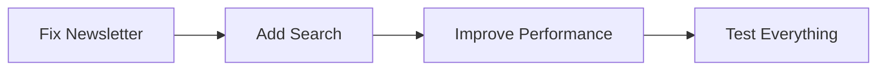
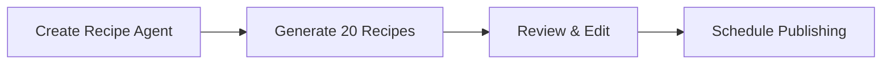
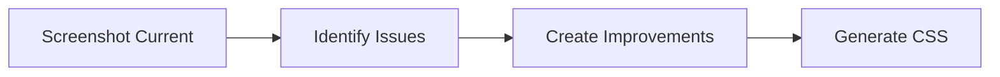

# CookThis.com - Optimal Workflow Strategy

## 🎯 Tool Selection Guide

### Use Cases for Each Environment

## 🖥️ **Claude Code (CLI - Current Session)**
**Best for: Technical Implementation & Testing**

### ✅ Use Claude Code For:
- **Newsletter integration** (Buttondown API setup)
- **Component development** (search, filters, etc.)
- **Performance optimization** (image processing, caching)
- **Build/deployment debugging**
- **Database/API integrations**
- **Complex refactoring**
- **Git operations and CI/CD**
- **Real-time testing** (npm run dev)
- **File system operations**
- **Debugging with console output**

### Advantages:
- Direct file system access
- Real-time command execution
- Immediate testing feedback
- Git integration
- No context switching
- Can run multiple processes
- Better for iterative development

---

## 🤖 **Claude Cowork (App Interface)**
**Best for: Content Strategy & Recipe Generation**

### ✅ Use Cowork Agents For:
- **Bulk recipe creation** (10+ recipes at once)
- **Recipe research & adaptation**
- **SEO optimization** (meta descriptions, tags)
- **Content planning** (editorial calendar)
- **Recipe categorization & tagging**
- **Writing newsletter content**
- **Creating recipe collections/themes**
- **Generating recipe variations**

### Advantages:
- Better for creative/writing tasks
- Can handle longer context
- Good for batch operations
- Parallel content generation
- Less technical overhead
- Better formatting for content review

---

## 📱 **Claude App Projects**
**Best for: Design & Visual Tasks**

### ✅ Use Claude Projects For:
- **Design mockups** (upload screenshots for feedback)
- **Color scheme refinement**
- **Typography decisions**
- **Layout improvements**
- **Mobile responsive design review**
- **Image selection/curation**
- **Brand voice development**
- **User experience planning**

### Advantages:
- Can analyze images/screenshots
- Good for design discussions
- Maintains design context
- Can reference design systems
- Better for visual feedback

---

## 🚀 **Recommended Workflow Split**

### Today's Priority Tasks

#### 1️⃣ **Newsletter Setup (Claude Code - Stay Here)**
```bash
# We'll implement Buttondown integration
# - API setup
# - Form validation
# - Success/error handling
# - Testing with real submissions
# Time: 1-2 hours
```

#### 2️⃣ **Design Improvements (Claude App Project)**
```
Create a new project:
- Upload current screenshots
- Share design inspiration
- Get specific CSS improvements
- Create design system document
Time: 1 hour
```

#### 3️⃣ **Recipe Creation (Claude Cowork Agent)**
```
Create a "Recipe Writer" agent:
- Provide recipe template
- Give category requirements
- Set tone/style guide
- Generate 10-20 recipes
Time: 2-3 hours (runs in background)
```

---

## 📋 **Optimal Workflow Process**

### Phase 1: Technical Foundation (Today - Claude Code)


### Phase 2: Content Pipeline (Today - Cowork Agent)


### Phase 3: Design System (Today - Claude App)


---

## 🎨 **Design Resources Ranked**

### For Your Minimalist Recipe Site:

#### 1. **Tailwind UI** (Best for You)
- **Why**: Pre-built Tailwind components
- **Cost**: $299 one-time
- **Link**: https://tailwindui.com
- **Use**: Copy/paste components directly

#### 2. **Refactoring UI**
- **Why**: Design principles for developers
- **Cost**: $79-149
- **Link**: https://www.refactoringui.com
- **Use**: Learn design decisions

#### 3. **Free Alternatives**
- **HyperUI**: Free Tailwind components
  - https://www.hyperui.dev
- **Tailwind Components**: Community components
  - https://tailwindcomponents.com
- **DaisyUI**: Tailwind component library
  - https://daisyui.com

#### 4. **Design Inspiration**
- **Minimal Gallery**: https://minimal.gallery
- **Awwwards Food**: https://www.awwwards.com/websites/food-drink/
- **SiteInspire**: https://www.siteinspire.com/websites?categories=19

---

## 🔄 **Today's Execution Plan**

### Morning (Claude Code - Technical)
```bash
# 1. Newsletter Integration (45 min)
- Implement Buttondown API
- Add form validation
- Create success state
- Test live submissions

# 2. Quick Improvements (30 min)
- Add loading states
- Improve error handling
- Optimize images
```

### Afternoon (Parallel Work)

#### Cowork Agent (Runs in Background)
```
Recipe Creation Agent:
- Input: Recipe template + guidelines
- Output: 20 markdown files ready to publish
- Categories: 5 breakfast, 10 dinner, 5 sides
- Style: Conversational but concise
```

#### Claude App Project (Design)
```
Design Improvement Project:
- Current screenshots
- Specific improvements needed
- Generate Tailwind classes
- Create component variations
```

### Evening (Claude Code - Integration)
```bash
# 3. Integrate Everything
- Add generated recipes
- Apply design improvements
- Test all features
- Deploy updates
```

---

## 📊 **Efficiency Comparison**

| Task | Claude Code | Cowork | App | Winner |
|------|------------|---------|-----|---------|
| Newsletter Fix | ⭐⭐⭐⭐⭐ | ⭐ | ⭐⭐ | **Code** |
| Recipe Creation | ⭐⭐ | ⭐⭐⭐⭐⭐ | ⭐⭐⭐ | **Cowork** |
| Design Updates | ⭐⭐⭐⭐ | ⭐⭐ | ⭐⭐⭐⭐⭐ | **App** |
| Testing | ⭐⭐⭐⭐⭐ | ⭐ | ⭐ | **Code** |
| SEO Setup | ⭐⭐⭐⭐⭐ | ⭐⭐ | ⭐⭐ | **Code** |
| Content Planning | ⭐⭐ | ⭐⭐⭐⭐⭐ | ⭐⭐⭐⭐ | **Cowork** |

---

## 🎯 **Decision: Hybrid Approach**

### Stay in Claude Code for:
✅ Newsletter implementation (next 1 hour)
✅ Technical features (search, filters)
✅ Performance optimization
✅ Testing and debugging

### Switch to Cowork for:
✅ Bulk recipe generation
✅ Content planning
✅ Newsletter content writing

### Use Claude App for:
✅ Design feedback
✅ Visual improvements
✅ Brand development

---

## 💡 **Pro Tips**

### Recipe Automation Strategy
1. **Create Template in Code**
```markdown
---
title: "{TITLE}"
description: "{DESCRIPTION}"
prepTime: {PREP}
cookTime: {COOK}
servings: {SERVINGS}
category: "{CATEGORY}"
tags: [{TAGS}]
---

## Ingredients
{INGREDIENTS}

## Instructions
{INSTRUCTIONS}

## Notes
{NOTES}
```

2. **Feed to Cowork Agent**
- "Generate 20 recipes using this template"
- "Focus on quick weeknight dinners"
- "Keep descriptions under 50 words"
- "Use common ingredients"

3. **Batch Process in Code**
```bash
# Review generated recipes
ls src/content/recipes/

# Test all recipes
npm run build

# Deploy all at once
git add . && git commit -m "Add 20 new recipes" && git push
```

---

## 📈 **Expected Timeline**

### Today (Day 1)
- ✅ Newsletter working (1 hr)
- ✅ 20 recipes generated (background)
- ✅ Design improvements identified (1 hr)
- ✅ Basic search implemented (1 hr)

### Tomorrow (Day 2)
- Review & publish recipes
- Implement design changes
- Add category pages
- Optimize images

### Week 1 Complete
- 30+ recipes published
- All core features working
- Professional design
- SEO optimized
- Ready for promotion

---

## 🚦 **Right Now Action**

**Stay in Claude Code** and let's:
1. Fix the newsletter integration (45 min)
2. Set up the recipe template (10 min)
3. Then you can start a Cowork agent for recipes (runs in background)
4. We continue with technical improvements here

This parallel approach will maximize efficiency - technical work here, content generation in Cowork, design planning in App.

Ready to start with the newsletter fix?